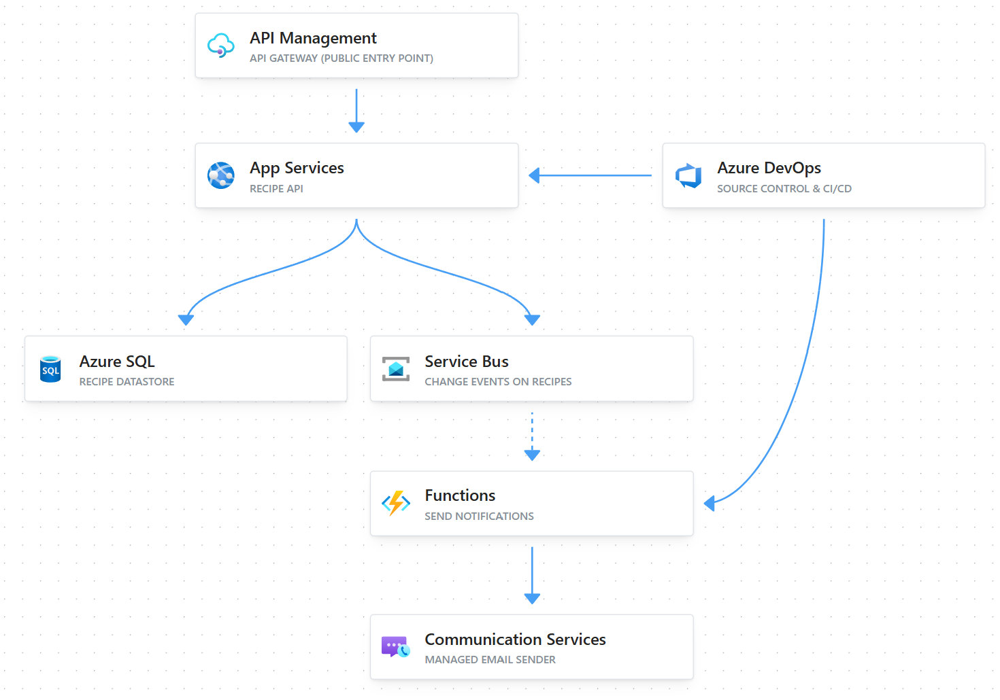
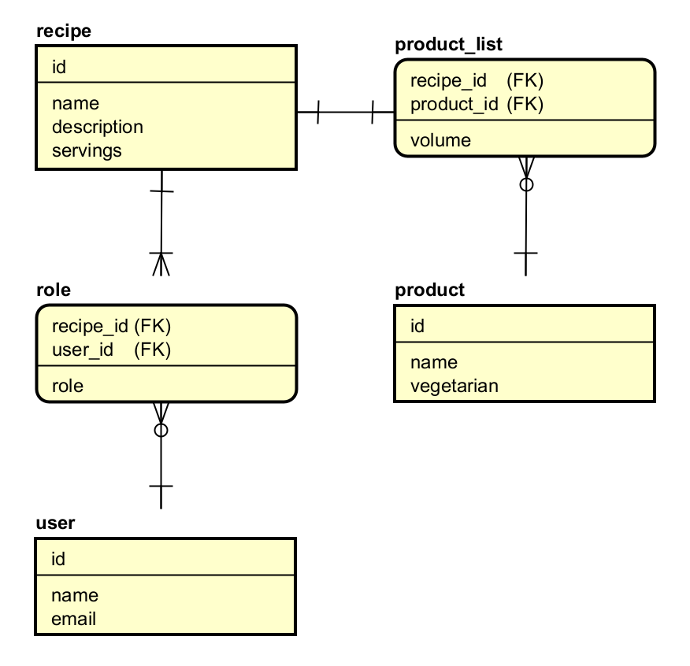

# Recipe backend assignment

## Project goal
Add, retrieve, update and remove recipes to a database. Filter on these recipes by vegetarian status, number of servings,
(exclusion) specific ingredients. Each recipe has an author and 0-n contributors linked to it. In the future all users related
to a recipe should receive notifications about the recipe.

## Infrastructure

### Running publicly on Azure
A mockup of how the service can be deployed. Using DevOps for Source control, CI/CD and the artifacts. One pipeline to 
build the artifact (once) and then deploy this the same way every time. A deployment of the code is made on an App Service,
a managed platform so there's no server or OS to maintain. It allows DevOps engineers to own the deployment without owning
much of the infrastructure. This is backed by an Azure SQL database as a managed datastore so backups are taken automatically. 

The App Service, database and Service Bus can be deployed to multiple environments (eg. development + production).
Keeping test data and changes isolated from live users while they are being developed and tested. They don't accept public 
traffic, the App Service only accepts traffic from the API Gateway and the database only accepts traffic from the
App Service. 

The public side is exposed via an API Gateway which is the single public entry point. It arranges TLS and handles authentication,
API keys and rate limiting so that the application itself doesn't have to. This provides a single and maintainable point of 
protection rather than each service doing it by itself. 

### Adding a notification service
A Service Bus is added in the same picture. It lets the notification event happen asynchronously. When a recipe is created 
or changed: the App Service saves it, publishes an event (containing the change and who is to be notified) on the Service 
Bus. The application can immediately return to its own flow. The event is picked up by a consumer, in this case an Azure 
Function that reads from the messages, and then calls the Communication Service. This is a managed sender service that 
delivers the email to the related users. So that the application does not require some sort of e-mail infrastructure. 

The App Service could call the Communication Service directly. This may depend on the use case or scale. Having a Service
Bus would allow other subscribers to consume for features such as a push notifications or audit logging. Also a Service Bus 
comes with mechanisms of retrying and a dead letter queue so that the application keeps its own responsibilities.

## API structure and documentation
Visit http://localhost:8080/swagger-ui.html for the full API documentation.

### Sample requests with filters
- GET http://localhost:8080/recipe > Resolves all recipes
- GET http://localhost:8080/recipe?vegetarian=true > Resolves only the vegetarian recipes
- GET http://localhost:8080/recipe?servings=5, > (note: comma is included!,) Resolves the recipes with 5 or more servings
- GET http://localhost:8080/recipe?servings=,2 > Resolves the recipes with at most 2 servings
- GET http://localhost:8080/recipe?excludeProducts=1,12,30,21,4 > Excludes specific products 
- GET http://localhost:8080/recipe?vegetarian=true&servings=4,4&excludeProducts=9 > Resolves one recipe

## Initial data model
Note: this was image was created upfront to form an idea, implementation differs slightly.

## Notes
These are notes I made along the way. Observations, choices and perhaps topics to discuss.
- Assignment states 'the code is production ready' but does not speak about authentication (or authorisation). In current
setup I defined a small AppUser that contains the name and e-mail. These are coupled through their role (author/contributor)
with the recipe. Upon further development this User table can be reused for authentication and Role for authorisation. Also
allow things like: can be edited or suggest and change to the recipe. 
- I designed vegetarian as part of a product. In a future version it may contain other allergenic info such as contains nuts.
That can then be extracted to a separate table, which might even allow for customised products (vegetarian chicken and regular 
chicken).
- The assignment did not speak about volumes, portions or amounts. I decided to include it, in the ingredient table, because
it allows for a better model both mentally and to implement.
- The codebase does not included profiles. In real scenario the (eg. when actually deploying it on Azure) this is mandatory. 
For instance when loading the sample data. That could then be excluded in production.
- I've chosen for a pragmatic "controller - service - repository"-approach and just the Entity and DTO models. I'd prefer 
for larger projects to include a POJO in between them. This allows a better independence from DB scheme changes and API 
contract changes (so the business logic is likely less effected).
- Spent some time trying to think if I could showcase the new proposed HTTP Query method (RFC 10008). But I thought it was 
too much for now. Perhaps a good discussion topic: it really solves a lot of issues with complex/long filter URLs and the 
endless GET vs POST discussion.
- I imagined a user creating a recipe by giving it a name and then adding their products and amounts. It could dynamically 
creat the products, but for now I focussed on the recipe part. So new recipes will use existing products or fail (miserably).
- I have added author explicitly to the RecipeRequest so that the validations can easily pick up and enforce there is always
an author added. Tradeoff: it is more coding to translate the request into an entity, but worth it for both implementer
and validation path I think.
- Ideally I'd further split service layers. For instance the RecipeService does all: fetching, building/changing, talking 
to the repository. Depending on use case and size of the project I'd take different approaches I guess. For instance using 
the hexagonal architecture approach would help, but in my opinion an overkill for such an assignment.